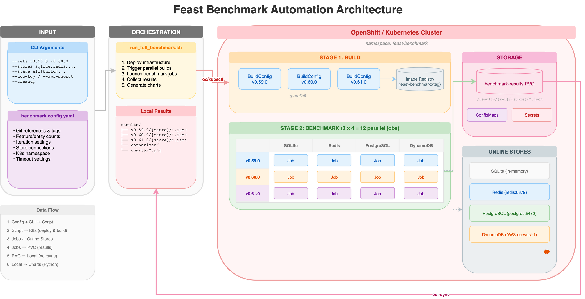
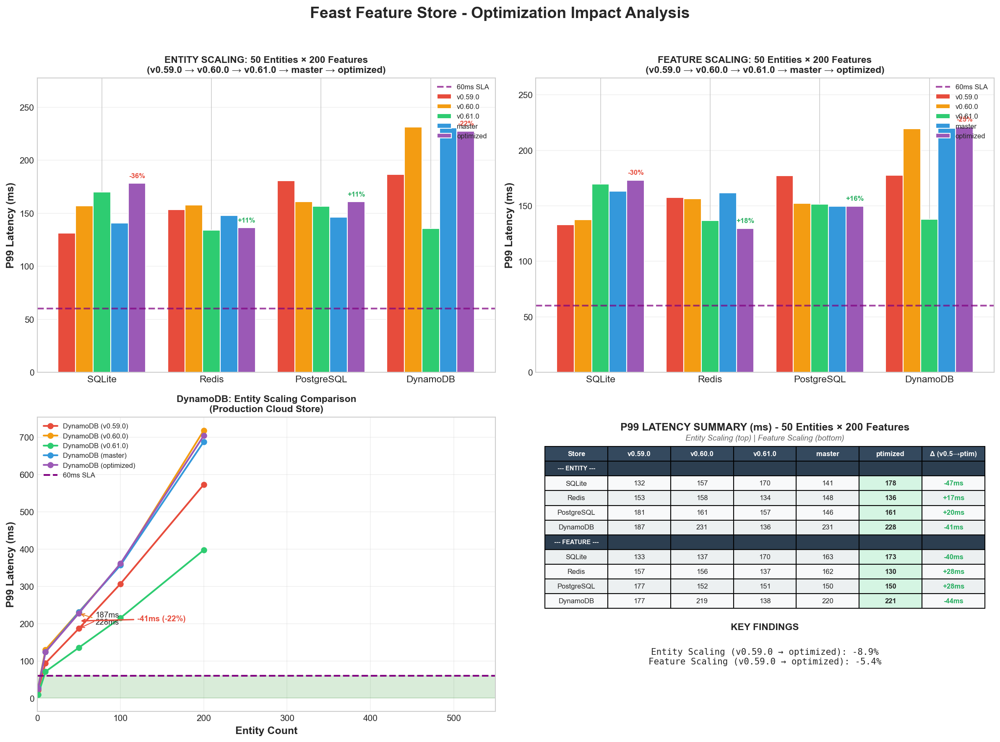
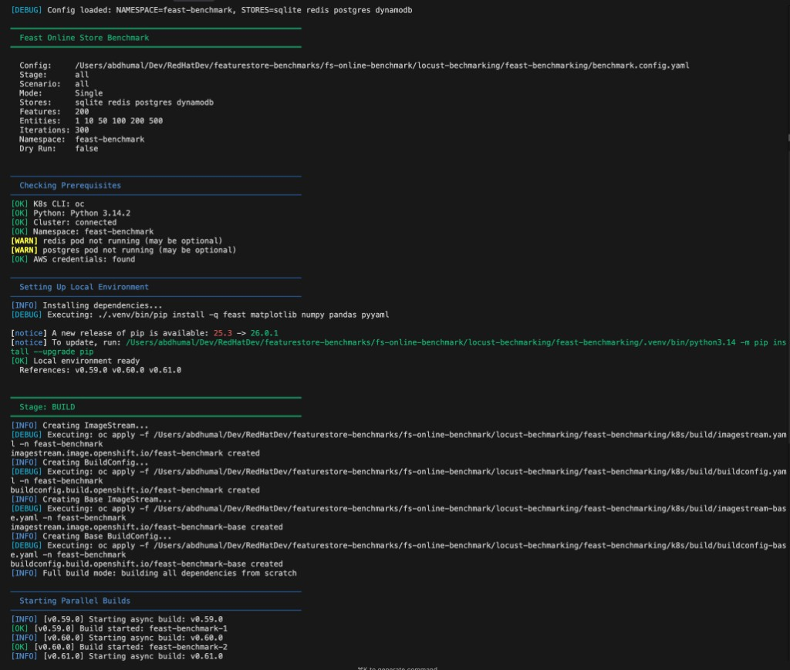
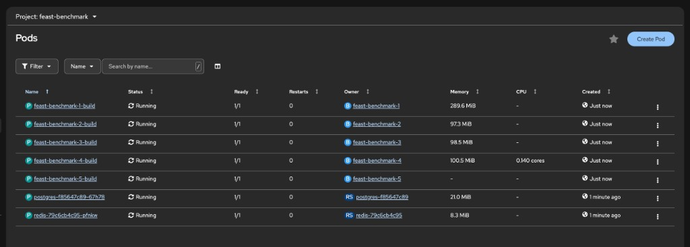
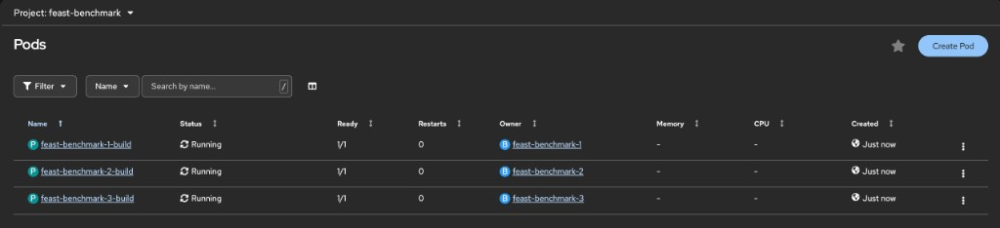
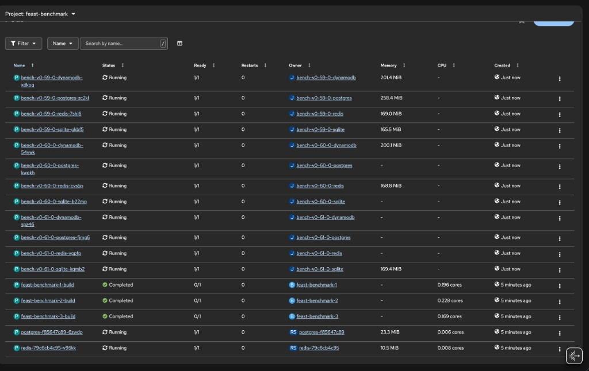

# Feast Online Store Benchmark Suite

Performance benchmarking framework for Feast online stores across **4 stores** (SQLite, Redis, PostgreSQL, DynamoDB) and **multiple Feast versions**.

---

## Architecture



> **Source**: [`docs/architecture.drawio`](docs/architecture.drawio) - Edit with draw.io  
> **Regenerate**: `./scripts/generate_architecture_diagram.sh`

---

## Quick Start

```bash
# Navigate to the benchmark directory
cd fs-online-benchmark/locust-bechmarking/feast-benchmarking

# Run all stages with AWS credentials (auto-deploys everything)
./run_full_benchmark.sh \
    --refs "v0.59.0,v0.60.0,v0.61.0" \
    --aws-key "AKIA..." \
    --aws-secret "..." \
    --stage all \
    --verbose

# Or skip DynamoDB (no AWS needed)
./run_full_benchmark.sh \
    --refs "v0.59.0,v0.60.0,v0.61.0" \
    --stores "sqlite redis postgres" \
    --stage all

# Cleanup all resources
./run_full_benchmark.sh --cleanup
```

---

## Executive Summary



### Performance at SLA Target (50 entities × 200 features)

| Store | v0.59.0 p50/p99 | v0.60.0 p50/p99 | v0.61.0 p50/p99 | Best For |
|-------|-----------------|-----------------|-----------------|----------|
| **Redis** | 79/153ms | 80/158ms | 74/134ms | Production ML inference |
| **SQLite** | 81/132ms | 88/157ms | 96/170ms | Development, testing |
| **PostgreSQL** | 99/181ms | 94/161ms | 93/157ms | Existing infrastructure |
| **DynamoDB** | 115/187ms | 130/231ms | 73/136ms | AWS serverless |

*Chart above shows p99 latency. SLA target: 60ms p99.*

### Key Findings

| Finding | Value | Implication |
|---------|-------|-------------|
| **Best Performance** | v0.61.0 DynamoDB (72.8ms) | Significant improvement in latest version |
| **SLA Compliance** | 1 entity only | 60ms target requires single-entity requests |
| **Bottleneck** | Feast SDK overhead (93%) | Database read is only 0.01-0.24% |

---

## Detailed Benchmark Results

### Latency Comparison (50 entities × 200 features, p50/p99)

| Version | Redis | SQLite | Postgres | DynamoDB | Best Store |
|---------|-------|--------|----------|----------|------------|
| v0.59.0 | 79/153ms | 81/132ms | 99/181ms | 115/187ms | SQLite |
| v0.60.0 | 80/158ms | 88/157ms | 94/161ms | 130/231ms | SQLite |
| v0.61.0 | 74/134ms | 96/170ms | 93/157ms | **73/136ms** | Redis |
| master | 79/148ms | 85/141ms | 82/146ms | 130/231ms | SQLite |
| optimized | 76/136ms | 96/179ms | 97/161ms | 130/228ms | Redis |

*SLA target: 60ms p99. Only 1-entity requests meet SLA across all stores.*

### Charts by Version

<details>
<summary><b>v0.61.0 (Latest Release)</b></summary>

- [Latency by Entities](results/v0.61.0/charts/01_latency_by_entities.png)
- [Latency by Features](results/v0.61.0/charts/01b_latency_by_features.png)
- [Production SLA Analysis](results/v0.61.0/charts/02_production_sla.png)
- [Executive Summary](results/v0.61.0/charts/03_executive_summary.png)
- [Bottleneck Breakdown](results/v0.61.0/charts/05_bottleneck_breakdown.png)
</details>

<details>
<summary><b>v0.60.0</b></summary>

- [Latency by Entities](results/v0.60.0/charts/01_latency_by_entities.png)
- [Latency by Features](results/v0.60.0/charts/01b_latency_by_features.png)
- [Production SLA Analysis](results/v0.60.0/charts/02_production_sla.png)
- [Executive Summary](results/v0.60.0/charts/03_executive_summary.png)
- [Bottleneck Breakdown](results/v0.60.0/charts/05_bottleneck_breakdown.png)
</details>

<details>
<summary><b>v0.59.0</b></summary>

- [Latency by Entities](results/v0.59.0/charts/01_latency_by_entities.png)
- [Latency by Features](results/v0.59.0/charts/01b_latency_by_features.png)
- [Production SLA Analysis](results/v0.59.0/charts/02_production_sla.png)
- [Executive Summary](results/v0.59.0/charts/03_executive_summary.png)
- [Bottleneck Breakdown](results/v0.59.0/charts/05_bottleneck_breakdown.png)
</details>

<details>
<summary><b>master (Development)</b></summary>

- [Latency by Entities](results/master/charts/01_latency_by_entities.png)
- [Latency by Features](results/master/charts/01b_latency_by_features.png)
- [Production SLA Analysis](results/master/charts/02_production_sla.png)
- [Executive Summary](results/master/charts/03_executive_summary.png)
- [Bottleneck Breakdown](results/master/charts/05_bottleneck_breakdown.png)
</details>

<details>
<summary><b>optimized (Performance Branch)</b></summary>

- [Latency by Entities](results/optimized/charts/01_latency_by_entities.png)
- [Latency by Features](results/optimized/charts/01b_latency_by_features.png)
- [Production SLA Analysis](results/optimized/charts/02_production_sla.png)
- [Executive Summary](results/optimized/charts/03_executive_summary.png)
- [Bottleneck Breakdown](results/optimized/charts/05_bottleneck_breakdown.png)
</details>

### Key Observations

1. **v0.61.0 DynamoDB** shows dramatic improvement (72.8ms vs 115-130ms) due to parallel batch optimizations
2. **Redis** remains consistently fastest across most versions (~75-80ms)
3. **No version** meets 60ms SLA for 50+ entities - only single-entity requests pass
4. **Database access** is minimal (0.01-0.24%); **Feast SDK overhead** dominates (93%+)

---

## Script Options

| Option | Default | Description |
|--------|---------|-------------|
| `--stores <list>` | `"sqlite redis postgres dynamodb"` | Stores to benchmark |
| `--refs <list>` | - | Feast versions (e.g., `"v0.59.0,v0.60.0"`) |
| `--stage <stage>` | `all` | `build`, `benchmark`, `charts`, or `all` |
| `--aws-key <key>` | - | AWS Access Key ID (for DynamoDB) |
| `--aws-secret <secret>` | - | AWS Secret Access Key |
| `--aws-region <region>` | `eu-west-1` | AWS Region |
| `--cleanup` | - | Clean up all resources |
| `--dry-run` | - | Preview without executing |
| `--verbose` | - | Enable debug logging |

### Examples

```bash
# Compare specific versions
./run_full_benchmark.sh --refs "v0.59.0,v0.60.0,v0.61.0"

# Test custom branch
./run_full_benchmark.sh --feast-git-ref perf/my-optimization

# Redis and Postgres only
./run_full_benchmark.sh --stores "redis postgres"

# Build images only
./run_full_benchmark.sh --refs "v0.59.0,v0.60.0,v0.61.0" --stage build

# Generate charts only (results must exist)
./run_full_benchmark.sh --refs "v0.59.0,v0.60.0,v0.61.0" --stage charts
```

---

## Setup

### Prerequisites

- OpenShift/Kubernetes cluster with `oc` or `kubectl`
- Python 3.11+
- AWS credentials (for DynamoDB only)

### One-Time Setup

```bash
# Clone repository
git clone https://github.com/abhijeet-dhumal/featurestore-benchmarks.git
cd featurestore-benchmarks/fs-online-benchmark/locust-bechmarking/feast-benchmarking

# Run with AWS credentials (auto-deploys infrastructure)
./run_full_benchmark.sh \
    --refs "v0.59.0,v0.60.0,v0.61.0" \
    --aws-key "AKIA..." \
    --aws-secret "..." \
    --stage all --verbose
```

> **Note:** The script automatically deploys namespace, PVC, Redis, PostgreSQL, and creates AWS credentials secret.

### Alternative: Pre-create AWS Secret

```bash
oc create secret generic aws-credentials -n feast-benchmark \
    --from-literal=AWS_ACCESS_KEY_ID=<your-key> \
    --from-literal=AWS_SECRET_ACCESS_KEY=<your-secret> \
    --from-literal=AWS_DEFAULT_REGION=eu-west-1 \
    --dry-run=client -o yaml | oc apply -f -
```

---

## Configuration

**Single Source of Truth:** `benchmark.config.yaml`

```yaml
# Feast versions to benchmark
references:
  v0.59.0:
    source: git
    git_url: "https://github.com/feast-dev/feast.git"
    git_ref: "v0.59.0"
  v0.60.0:
    git_ref: "v0.60.0"
  v0.61.0:
    git_ref: "v0.61.0"

# Benchmark parameters
benchmark:
  features: 200
  entities: [1, 10, 50, 100, 200, 500]
  iterations: 300
  warmup: 20
  sla_ms: 60

# Kubernetes settings
kubernetes:
  namespace: "feast-benchmark"
  job_timeout: 1800
```

---

## Dataset Configuration

### Overview

| Property | Value |
|----------|-------|
| **Data Type** | Synthetic (generated at runtime) |
| **Entity Type** | User ID (string) |
| **Feature Count** | 200 (configurable) |
| **Feature Type** | Float64 (uniform) |
| **Entity Count** | Up to 500 per request |

### Entity Scaling Test

| Parameter | Value |
|-----------|-------|
| **Fixed** | 200 features |
| **Variable** | 1, 10, 50, 100, 200, 500 entities |
| **SLA Point** | 50 entities × 200 features @ 60ms p99 |

### Feature Scaling Test

| Parameter | Value |
|-----------|-------|
| **Fixed** | 50 entities |
| **Variable** | 5, 25, 50, 100, 150, 200 features |

### Why Synthetic Data?

| Benefit | Description |
|---------|-------------|
| **Reproducibility** | Same data every run |
| **Isolation** | Tests store performance, not data complexity |
| **Fair Comparison** | Uniform types across all stores |

---

## Directory Structure

```
feast-benchmarking/
├── run_full_benchmark.sh       # Main automation script
├── benchmark.config.yaml       # Configuration file
├── README.md                   # This file (includes benchmark results)
├── scripts/
│   ├── unified_benchmark.py    # Core benchmark logic
│   ├── generate_charts.py      # Chart generation
│   └── setup_dax.sh            # DAX cluster setup/teardown
├── k8s/                        # Kubernetes manifests (Kustomize)
│   ├── base/                   # Namespace, PVC, ConfigMaps
│   ├── stores/                 # Redis, PostgreSQL deployments
│   ├── jobs/                   # Benchmark job definitions
│   └── build/                  # OpenShift build resources
├── docs/
│   ├── DAX_SETUP.md            # DAX cluster setup guide
│   ├── DAX_BENCHMARK_FINDINGS.md  # DAX performance analysis
│   └── images/                 # Screenshots and diagrams
└── results/                    # Output (per Git reference)
    ├── v0.59.0/{store}/charts/
    ├── v0.60.0/{store}/charts/
    ├── v0.61.0/{store}/charts/
    ├── master/{store}/charts/
    ├── optimized/{store}/charts/
    └── comparison/charts/
```

---

## Stages

| Stage | Description | Command |
|-------|-------------|---------|
| `build` | Build Docker images for each Feast version (parallel) | `--stage build` |
| `benchmark` | Run K8s jobs and collect results (12 parallel jobs) | `--stage benchmark` |
| `charts` | Generate visualization charts | `--stage charts` |
| `all` | Run all stages (default) | `--stage all` |

### Build Stage

Creates parallel BuildConfigs for each Feast version reference.

**Terminal Output:**



**OpenShift Console (5 parallel builds for all refs):**



*Shows 5 parallel build pods running for v0.59.0, v0.60.0, v0.61.0, master, and perf-with-6optimisations*

**OpenShift Console (3 parallel builds - subset):**



```bash
# Watch build pods
oc get pods -n feast-benchmark -w

# Check build logs
oc logs -f feast-benchmark-1-build -n feast-benchmark
```

### Benchmark Stage

Runs parallel jobs for all version × store combinations (e.g., 20 jobs for 5 versions × 4 stores).

**OpenShift Console (12 parallel jobs):**



```bash
# Watch benchmark pods
oc get pods -n feast-benchmark -w

# Check specific job logs
oc logs -f bench-v0-59-0-redis-xxxxx -n feast-benchmark
```

---

## Kubernetes Deployment

### Structure

```
k8s/
├── base/                   # Namespace, PVC, ConfigMaps
├── stores/                 # Redis, PostgreSQL deployments
├── jobs/                   # Benchmark job templates
└── build/                  # OpenShift BuildConfig, ImageStream
```

### Manual Deployment

```bash
# Deploy infrastructure
kustomize build k8s | oc apply -f -

# Wait for stores
oc rollout status deployment/redis -n feast-benchmark
oc rollout status deployment/postgres -n feast-benchmark
```

### Resources Created

| Resource | Purpose |
|----------|---------|
| `Namespace` | feast-benchmark - isolated environment |
| `PVC` | benchmark-results - shared storage |
| `ConfigMap` | benchmark-config, benchmark-script |
| `Secret` | aws-credentials, postgres-secret |
| `Deployment` | redis, postgres |
| `Job` | bench-{version}-{store} |
| `BuildConfig` | feast-benchmark image builder |
| `ImageStream` | feast-benchmark image storage |

---

## Generated Charts

| Chart | Description |
|-------|-------------|
| `01_latency_by_entities.png` | P99 latency by entity count |
| `01b_latency_by_features.png` | P99 latency by feature count |
| `02_production_sla.png` | SLA gap analysis (log scale) |
| `03_executive_summary.png` | 4-panel stakeholder overview |
| `05_bottleneck_breakdown.png` | Function-level profiling |
| `01_cross_reference_comparison.png` | Multi-version comparison |

---

## Store Comparison

### Performance Hierarchy (v0.61.0, 50 entities)

```
Fastest ──────────────────────────────────────────── Slowest

   DynamoDB  <  Redis  <  PostgreSQL  <  SQLite
   
   @ 1 entity:    ~7ms     ~5ms       ~6ms         ~6ms
   @ 50 entities: ~73ms    ~74ms      ~93ms        ~96ms
   @ 200 entities: ~374ms  ~350ms     ~400ms       ~420ms
```

*Note: DynamoDB improved significantly in v0.61.0 due to parallel batch optimizations*

### Store Selection Guide

| Use Case | Recommended | Rationale |
|----------|-------------|-----------|
| Production ML inference | Redis | Consistent low latency |
| Development/Testing | SQLite | Zero setup |
| AWS native | DynamoDB | Auto-scaling, best in v0.61.0 |
| Existing Postgres | PostgreSQL | No new infra |

---

## Bottleneck Analysis

### Time Breakdown (50 entities × 200 features)

```
├── Feast SDK Overhead:     ~68ms (93%)  ← Largest contributor
├── Protobuf Conversion:    ~5ms  (6-12%)
├── Entity Serialization:   ~0.2ms (0.1-0.3%)
├── Online Store Read:      ~0.1ms (0.01-0.24%)  ← Database is NOT the bottleneck
└── Other Processing:       ~1ms  (1%)
```

**Key Insight:** Database read is only 0.01-0.24% of latency. The bottleneck is Feast SDK processing.

### DAX (DynamoDB Accelerator) Analysis

DAX provides 40-70% raw database improvement but <5% end-to-end improvement because:
- Database access is only 0.01-0.24% of total latency
- Feast's serialization and framework overhead dominate (93%+)

See [DAX Benchmark Findings](docs/DAX_BENCHMARK_FINDINGS.md) for details.

---

## Production Recommendations

### For SLA Compliance (≤60ms P99)

1. Use **Redis** with ≤10 entities per request
2. Keep feature count ≤25 for larger batches
3. Use the latest Feast version

### If SLA Still Not Met

| Option | Trade-off |
|--------|-----------|
| Tiered SLA (60ms @ 10 entities) | Documentation change |
| Horizontal scaling (2-4x replicas) | Infrastructure cost |
| Client-side batching | Application change |

---

## Troubleshooting

```bash
# Check job status
oc get jobs -n feast-benchmark -l app=feast-benchmark

# Check pod logs
oc logs -n feast-benchmark -l store=redis

# Verify AWS credentials
oc get secret aws-credentials -n feast-benchmark

# View PVC contents
oc run debug --rm -it --image=busybox -n feast-benchmark \
    --overrides='{"spec":{"containers":[{"name":"debug","image":"busybox","command":["sh"],"volumeMounts":[{"name":"results","mountPath":"/results"}]}],"volumes":[{"name":"results","persistentVolumeClaim":{"claimName":"benchmark-results"}}]}}' \
    -- ls -la /results/

# Clean up jobs
oc delete jobs -l app=feast-benchmark -n feast-benchmark

# Delete entire namespace
oc delete namespace feast-benchmark
```

---

## Performance Optimization PRs

| PR | Improvement | Impact |
|----|-------------|--------|
| [#6003](https://github.com/feast-dev/feast/pull/6003) | Timestamp O(n×m) → O(n) | -5 to -10ms |
| [#6006](https://github.com/feast-dev/feast/pull/6006) | Entity key deduplication | -3 to -5ms |
| [#6014](https://github.com/feast-dev/feast/pull/6014) | Registry N+1 fix | -1 to -2ms |
| [#6015](https://github.com/feast-dev/feast/pull/6015) | MessageToDict 4x faster | -5 to -15ms |
| [#6023](https://github.com/feast-dev/feast/pull/6023) | Redis protobuf parsing | -2 to -5ms |
| [#6024](https://github.com/feast-dev/feast/pull/6024) | DynamoDB parallel batches | -40 to -120ms |
| [#6025](https://github.com/feast-dev/feast/pull/6025) | DAX client support | ~5% (SDK bottleneck) |

---

*Last updated: March 20, 2026*
